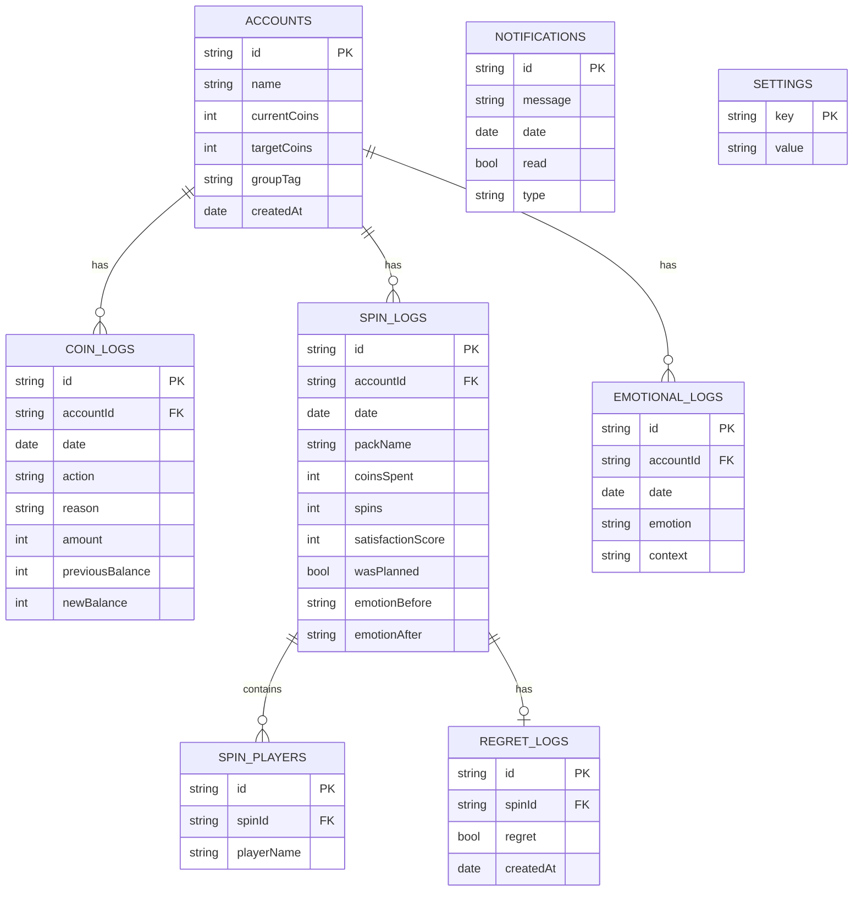

# RAPPORT D'AUDIT — EFOOTBALL COIN MANAGER PRO (Étape 1)

Ce document contient l'intégralité du contexte du projet depuis le début de la discussion : le cahier des charges original, l'analyse des manques, les contraintes produit non négociables, les décisions prises, le schéma de données, l'arborescence des écrans, le plan de développement, et le code source complet livré jusqu'ici. Il est conçu pour être copié-collé en entier dans un autre assistant (ChatGPT, etc.) afin d'obtenir un audit indépendant, sans avoir besoin de transmettre le fichier .zip lui-même.

---

## 1. Cahier des charges original (fourni par l'utilisateur en tout début de discussion)

```markdown
# EFOOTBALL COIN MANAGER PRO

## Overview
Application desktop pour joueurs eFootball gérant plusieurs comptes. Combine suivi des coins,
analytique, prévision de progression, contrôle des dépenses, et assistance psychologique pour
maximiser l'efficacité des coins sur le long terme.

## Objectifs principaux
- Gérer plusieurs comptes eFootball
- Suivre l'accumulation de coins
- Suivre la progression vers 900+ coins
- Réduire les spins impulsifs
- Analyser le comportement de dépense
- Fournir une assistance psychologique post-perte
- Améliorer la prise de décision long terme

## Fonctionnalités prévues dans le document original
- Gestion de comptes (19 comptes par défaut listés : EB5, EB4, GAME4, 2004, 3XB, DOV, CNX,
  AC1-AC7, SEL, SUPF, TSTM1, TSTM2, RAST1)
- Journal de coins (ADD / REMOVE / SET_BALANCE), avec sources (Login Bonus, Event Reward,
  Objective Reward, Match Reward, Campaign Reward, Compensation, Purchase, Custom) et usages
  (Spin, Pack Opening, Other)
- Suivi de progression (% vers 900, moyenne quotidienne, date estimée)
- Système d'alertes (900 atteint, 1000 atteint, +500 dépensés en 24h, sessions de spin multiples,
  dépense anormale)
- Dashboard analytique (statistiques globales et par compte)
- Graphiques (progression journalière/hebdo/mensuelle, comparaison de comptes, dépenses)
- Spin tracker (pack, coins dépensés, nombre de spins, joueurs obtenus, score de satisfaction)
- Mental Coach :
  - Mode Protection 900 (alerte sous le seuil recommandé)
  - Détection d'impulsivité (planifié ? frustré ? FOMO ? chasse comportementale ?)
  - Assistant Anti-FOMO (rappels que les joueurs/packs reviendront)
  - Mode urgence ("I WANT TO SPIN" avec cooldown 5 min, analyse de coût, historique de regrets)
  - Récupération post-perte (après 900+ coins dépensés sans résultat satisfaisant)
  - Suivi des regrets (oui/non après chaque spin, taux de regret, coins perdus en spins regrettés)
  - Journal émotionnel (avant/après spin : excité, curieux, frustré, ennuyé, stressé, confiant)
  - Score de discipline (0-100, basé sur jours sans spin impulsif, coins préservés, objectifs
    atteints, spins annulés)
  - Moteur de prévision (moyenne quotidienne, projection de solde futur, date estimée pour 900/1000)
- Stack technique proposée à l'origine : React + Vite + TailwindCSS + AG Grid + Chart.js,
  Electron (desktop), SQLite (base de données)
- Fonctionnalités futures évoquées : Cloud Sync, app mobile, analyse comportementale IA,
  notation de la valeur des packs, système de succès, statistiques communautaires, intégration EFHub
- Métriques de succès évoquées : nombre de comptes atteignant 900, réduction des spins impulsifs,
  réduction du taux de regret, amélioration de l'épargne en coins, amélioration du score de discipline
```

---

## 2. Analyse initiale — manques identifiés et recommandations

### Manques critiques relevés
- **Lien spin ↔ coin log absent** dans le document original : un spin doit créer automatiquement
  une entrée dans le journal de coins (action REMOVE), sinon le solde affiché et l'historique
  peuvent diverger.
- **Aucun suivi de l'argent réel dépensé** (uniquement des coins en jeu) — recommandé à l'origine
  comme la fonctionnalité la plus importante pour le volet "garde-fou anti-impulsivité", mais
  **l'utilisateur a choisi de ne PAS l'implémenter** (confirmé non-négociable, voir section 3).
- **players_obtained mal typé pour une base relationnelle/IndexedDB** : un tableau de joueurs au
  sein d'un log de spin doit être une table séparée plutôt qu'un champ JSON brut.
- **Pas de validation/garde-fou de base** : empêcher un solde négatif, empêcher un montant négatif
  ou nul, pas de mécanisme d'annulation d'une entrée erronée.
- **Pas de stratégie de versioning du schéma de base de données**, nécessaire dès qu'on fait
  évoluer la structure des tables sans casser les données existantes des utilisateurs.

### Manques fonctionnels (moins urgents)
- Pas d'export/import des données (sauvegarde/restauration).
- Pas de table `settings`/préférences dédiée (langue, seuils personnalisés, devise, notifications).
- 19 comptes "par défaut" hardcodés dans le document original — recommandation : partir d'une
  liste vide et permettre de grouper les comptes par catégorie (Principal / Farm / Test).
- Formule du Score de Discipline non pondérée dans le document original (facteurs listés mais
  pas de pondération précise) — à définir avant de coder l'algorithme.
- Pas de pagination prévue pour les journaux de logs, qui vont grossir avec le temps.
- Notifications système vs in-app non tranché.

---

## 3. Contraintes produit — NON NÉGOCIABLES

Ces contraintes ont été formalisées explicitement par l'utilisateur et priment sur toute autre
recommandation d'architecture ou de feature. Tout audit ou toute suggestion d'évolution doit les
respecter strictement.

- Application **100 % locale**
- **Aucun backend**
- **Aucun compte utilisateur**
- **Aucun suivi d'argent réel**
- Persistance via **IndexedDB uniquement**
- **Les données ne quittent jamais l'appareil** (aucun appel réseau sortant de données utilisateur)
- **Priorité absolue : prévention des spins impulsifs avant 900 coins**
- **Le Mental Coach est une fonctionnalité centrale du produit** (pas une fonctionnalité annexe
  ou un "bonus" relégué en fin de roadmap)
- **Chaque spin doit automatiquement créer une entrée Coin Log**

### Conformité du code livré à ce jour (étape 1)

| Contrainte | État |
|---|---|
| 100% locale, aucun backend | ✅ — Vite + IndexedDB, zéro appel réseau dans le code |
| Aucun compte utilisateur | ✅ — jamais implémenté |
| Aucun suivi d'argent réel | ✅ — aucune table ni champ ne stocke de montant en monnaie réelle |
| Persistance IndexedDB uniquement | ✅ — implémenté via Dexie.js (`src/db.js`) |
| Données ne quittent jamais l'appareil | ✅ — aucun `fetch`/appel réseau de données utilisateur dans le code |
| Chaque spin → Coin Log auto | ⬜ — pas encore codé, prévu étape 2 (le mécanisme `applyCoinChange` existe déjà et sera réutilisé) |
| Mental Coach central / priorité absolue | ⬜ — pas encore codé, **repriorisé en étape 2** (voir section 6, roadmap mise à jour) |

---

## 4. Décisions actées (stack et architecture)

| Sujet | Décision |
|---|---|
| Stockage | Web local avec IndexedDB (via Dexie.js) — pas d'Electron, pas de SQLite, pas de backend |
| Argent réel dépensé | Non suivi — uniquement les coins en jeu (cf. contrainte non négociable) |
| Lien spin → coin log | Chaque spin doit créer automatiquement une entrée coinLogs (étape 2) |
| Joueurs obtenus | Table séparée `spinPlayers` plutôt qu'un tableau JSON |
| Stack technique | React + Vite + TailwindCSS + Dexie.js + Chart.js (au lieu d'Electron/SQLite/AG Grid) |
| Persistance | Automatique et permanente — l'utilisateur ne doit jamais ressaisir ses données à chaque session |
| Priorité roadmap | Le Mental Coach (Protection 900 + Détection d'impulsivité) est avancé et fusionné avec le Spin Tracker dès l'étape 2, plutôt que relégué en fin de roadmap |

---

## 5. Schéma de données (8 tables IndexedDB / Dexie)

Représentation ERD (format Mermaid, peut être collé dans n'importe quel outil compatible mermaid pour visualisation) :



Règle d'intégrité centrale : **toute modification de `currentCoins` doit obligatoirement passer
par une fonction unique qui écrit aussi un coinLog** (voir `src/accountActions.js` →
`applyCoinChange`). C'est le garde-fou pour que le solde affiché et l'historique ne divergent
jamais. Cette même fonction sera réutilisée par le futur Spin Tracker pour respecter la
contrainte "chaque spin doit automatiquement créer une entrée Coin Log".

---

## 6. Arborescence des écrans

Structure générale de la fenêtre (sidebar + zone de contenu) :

```
┌─────────────────────────────────────────────┐
│ Application (fenêtre principale)             │
│ ┌────────────┐ ┌──────────────────────────┐ │
│ │  Sidebar   │ │   Zone de contenu         │ │
│ │            │ │   (change selon l'onglet  │ │
│ │ Dashboard  │ │    actif)                 │ │
│ │ Comptes    │ │                           │ │
│ │ Spin tr.   │ │                           │ │
│ │ Mental c.  │ │                           │ │
│ │ Analytics  │ │                           │ │
│ │ Paramètres │ │                           │ │
│ └────────────┘ └──────────────────────────┘ │
└─────────────────────────────────────────────┘
```

Détail de la section "Mental coach" (la plus riche, divisée en deux temps — note : Protection 900
et Détection d'impulsivité sont désormais codées dès l'étape 2, le reste suit aux étapes 3-4) :

```
Mental coach
├── Avant le spin
│   ├── Protection 900            (étape 2 — fusionné avec Spin Tracker)
│   ├── Détection d'impulsivité   (étape 2 — fusionné avec Spin Tracker)
│   ├── Anti-FOMO                  (étape 3)
│   └── Mode urgence (cooldown)    (étape 3)
└── Après le spin
    ├── Récupération post-perte    (étape 3)
    ├── Suivi des regrets           (étape 3)
    ├── Journal émotionnel          (étape 4)
    └── Score de discipline         (étape 4)
```

---

## 7. Plan de développement par étapes (mis à jour après reprioritisation)

1. ✅ Squelette (sidebar + routing) + CRUD comptes + ajustement de solde — **livré, audité ci-dessous**
2. ⬜ **Spin Tracker + Coin Log automatique + Protection 900 Mode + Détection d'impulsivité** (fusionnés — priorité absolue du produit)
3. ⬜ Anti-FOMO + Mode urgence ("I WANT TO SPIN") + Récupération post-perte + Suivi des regrets
4. ⬜ Journal émotionnel + Score de discipline + Moteur de prévision
5. ⬜ Analytics / graphiques (Chart.js)
6. ⬜ Paramètres avancés / notifications

Changement par rapport au plan précédent : le Mental Coach (volets Protection 900 et Détection
d'impulsivité) n'est plus en fin de roadmap (ex-étape 5) mais fusionné dans l'étape 2, conformément
à la contrainte produit "priorité absolue : prévention des spins impulsifs avant 900 coins" et
"le Mental Coach est une fonctionnalité centrale du produit". Les graphiques Analytics, moins
critiques, sont repoussés après le cœur du Mental Coach.

---

## 8. Points connus à auditer / questions ouvertes

- `applyCoinChange` empêche un solde négatif sur REMOVE — mais aucune limite n'est posée sur ADD/SET_BALANCE (pas de borne haute). Est-ce voulu ?
- Pas encore de pagination sur les futurs logs (coinLogs va grossir avec le temps) — à surveiller dès l'étape 2.
- Pas de tests automatisés (unitaires ou e2e) pour l'instant — uniquement vérifié par `npm run build` qui passe sans erreur.
- Le composant `ModalShell` a un `style={{ borderRadius: 0 }}` qui semble inutile/mort — résidu d'une contrainte de design plus haut dans la conversation, à vérifier s'il doit être retiré.
- Architecture de navigation simple (pas de lazy-loading des routes) — suffisant pour une app de cette taille, mais à signaler si l'auditeur juge que c'est limitant.
- À l'étape 2, bien vérifier que le Spin Tracker, la Protection 900 et la Détection d'impulsivité partagent une UI cohérente plutôt que d'être 3 écrans disjoints — ils doivent former un seul flux ("avant de spinner").

---

## 9. Vision produit

Le produit n'est pas un simple gestionnaire de comptes eFootball. Le produit est un **outil de
discipline comportementale** dont la finalité est :
- Maximiser le nombre de comptes atteignant 900 coins.
- Réduire les dépenses impulsives.
- Réduire les regrets post-spin.
- Aider l'utilisateur à prendre des décisions rationnelles.
- Utiliser les données historiques pour améliorer progressivement les comportements.

Les fonctionnalités de suivi de comptes, logs, analytics et statistiques existent **principalement
pour soutenir cet objectif comportemental** — elles ne sont pas des fins en soi.

**Mesure du succès** : le succès du produit n'est donc pas mesuré uniquement par les
fonctionnalités techniques livrées, mais par sa capacité à réduire les spins impulsifs et à
augmenter le nombre d'objectifs 900 atteints.

### Implication pour les choix techniques à venir
Cette vision confirme et renforce la reprioritisation actée en section 7 : toute fonctionnalité
qui ne contribue pas directement à (a) prévenir un spin impulsif, ou (b) mesurer/améliorer le
comportement dans le temps, est secondaire. En particulier :
- Le Spin Tracker n'est pas une fin en soi — c'est la source de données qui alimente le Mental
  Coach et le Score de Discipline.
- Les graphiques Analytics doivent, à terme, être pensés comme des indicateurs de comportement
  (taux de regret, fréquence des spins impulsifs, nombre d'objectifs 900 atteints) plutôt que de
  simples graphiques de solde.
- Toute nouvelle fonctionnalité proposée plus tard (Cloud Sync, app mobile, etc.) doit être
  évaluée à l'aune de cette mission avant d'être ajoutée à la roadmap.

---

## 10. Référentiel UI/UX — exigences obligatoires

**Référence citée par l'utilisateur** (non récupérée automatiquement par l'assistant — fournie
telle quelle comme cahier des charges UX, à valeur normative pour toute décision d'interface
future) : *"UI UX Pro Max Skill" by NextLevelBuilder* —
`https://github.com/nextlevelbuilder/ui-ux-pro-max-skill`

Toute décision d'UI/UX future (écran, composant, workflow, interaction) doit suivre ce process
et ces règles, qui priment sur les préférences esthétiques.

### Processus de conception obligatoire (avant toute implémentation d'écran/composant)
1. Définir l'objectif utilisateur
2. Définir les points de friction
3. Définir l'objectif comportemental
4. Concevoir le flux utilisateur
5. Concevoir l'interface
6. Valider l'accessibilité
7. Valider la responsivité
8. Valider la charge cognitive
9. Valider l'impact comportemental

### Type de produit
L'application doit être traitée comme : **Dashboard comportemental + Tracker de type finance
personnelle + Système d'aide à la décision**.

Elle ne doit **jamais** être traitée comme :
- Application sociale
- Compagnon de jeu ("gaming companion")
- Application de divertissement
- Simulateur de gambling

### Ordre de priorité UX
1. Prévenir les spins impulsifs
2. Augmenter le taux d'atteinte de l'objectif 900 coins
3. Améliorer la discipline long terme
4. Fournir des analytics
5. Fournir des visualisations

### Règles UX fondamentales
- L'information importante doit apparaître **avant** une décision de spin.
- La friction est **intentionnellement autorisée** avant une dépense de coins.
- La friction doit être **minimisée** pour les comportements d'épargne.
- Toute action de dépense doit être **réversible** quand c'est techniquement possible.
- Toute action de dépense doit afficher ses **conséquences**.
- Toute action de dépense doit afficher son **coût d'opportunité**.

### Exigences du Dashboard
Le dashboard doit prioriser :
1. Score de discipline
2. Comptes approchant 900
3. Série d'épargne en cours ("streak")
4. Coins préservés
5. Spins impulsifs évités
6. Total des coins

Le dashboard ne doit **pas** prioriser :
- Nombre de spins
- Joueurs rares obtenus
- Hype autour des packs
- Métriques d'excitation

### Exigences du Mental Coach
- Le Mental Coach est un **système central**, pas une fonctionnalité annexe.
- Les écrans du Mental Coach doivent être traités comme des **flux produit primaires**.
- Les métriques du Mental Coach doivent avoir une importance visuelle **égale ou supérieure**
  aux soldes de coins.

### Exigences d'accessibilité (minimum)
- Conformité de contraste WCAG AA
- Support complet de la navigation au clavier
- États de focus visibles
- Layout responsive
- Cibles tactiles adaptées au mobile
- Système d'espacement cohérent

### Exigences de design system
À utiliser : design tokens, tokens de couleur, échelle typographique, échelle d'espacement,
bibliothèque de composants centralisée.
À éviter : couleurs en dur dans le code, espacements en dur, variantes de composants
incohérentes entre écrans.

### Philosophie analytics
Les analytics ne sont **pas** le produit — elles existent uniquement pour améliorer les résultats
comportementaux. Chaque graphique doit répondre à au moins une de ces questions :
- La discipline s'est-elle améliorée ?
- Le comportement impulsif a-t-il diminué ?
- Le taux d'atteinte de l'objectif 900 s'est-il amélioré ?
- Le regret a-t-il diminué ?

Si un graphique ne peut répondre à aucune de ces questions, il est considéré comme secondaire.

### Critères d'évaluation des implémentations futures
- Efficacité comportementale
- Clarté UX
- Accessibilité
- Maintenabilité
- Intégrité des données
- Performance

**L'esthétique visuelle seule ne doit jamais être un critère de succès.**

### Conséquences concrètes pour le code déjà livré (étape 1) et à venir

| Exigence | Impact sur le code existant / à venir |
|---|---|
| Dashboard sans métriques d'excitation | Le Dashboard actuel (`src/pages/Dashboard.jsx`) affiche Total coins, Moyenne, Comptes ≥900 — conforme. Il faudra ajouter dès l'étape 2 : Score de discipline, Streak, Coins préservés, Spins impulsifs évités, et les faire apparaître **avant** le total des coins. |
| Conséquence + coût d'opportunité avant dépense | Le futur écran de spin (étape 2) doit afficher, avant validation, l'impact sur le solde ET la distance restante à 900 — pas seulement après coup. |
| Réversibilité des dépenses | `applyCoinChange` permet déjà un ADD compensatoire, mais il n'y a pas encore de fonction d'annulation directe d'un log — à ajouter à l'étape 2. |
| Design tokens centralisés | Le thème Tailwind actuel (`tailwind.config.js`) définit déjà des couleurs nommées (ink, panel, accent...) plutôt que des couleurs en dur dans les composants — bonne base, à étendre avec une échelle d'espacement et une vraie bibliothèque de composants (boutons, champs, cartes) réutilisables. |
| Accessibilité WCAG AA / clavier / focus visible | Pas encore audité — à faire avant ou pendant l'étape 2, notamment sur les modales (`Accounts.jsx`) qui n'ont pas de gestion de focus trap ni de fermeture au clavier (Échap) actuellement. |

---

## 11. Code source intégral

### `README.md`

```md
# eFootball Coin Manager Pro — Étape 1

Squelette de l'application : navigation (sidebar + routing) et gestion complète des comptes (CRUD), avec persistance permanente des données.

## Installation

```bash
npm install
npm run dev
```

Ouvre ensuite l'URL affichée dans le terminal (en général `http://localhost:5173`).

## Persistance des données — important

Toutes les données (comptes, soldes, historique) sont stockées dans **IndexedDB**, une base de données intégrée au navigateur, via la librairie Dexie.

Concrètement :
- Tu n'as **jamais besoin de réinsérer tes données**. Ferme l'onglet, redémarre ton ordinateur, relance `npm run dev` un autre jour : tout est encore là.
- Les données vivent dans le navigateur **et le port** où tu as ouvert l'app (ex: `localhost:5173`). Si tu changes de navigateur ou de machine, utilise **Paramètres → Exporter un backup** puis **Importer** sur l'autre machine.
- Rien n'est envoyé sur internet, tout reste en local.

## Ce qui est livré dans cette étape

- Navigation complète (Dashboard, Comptes, Spin tracker, Mental coach, Analytics, Paramètres) — seules Dashboard et Comptes sont fonctionnelles, les autres sont des emplacements réservés pour les prochaines étapes.
- Comptes : créer, modifier (nom/objectif/groupe), ajuster le solde (Ajouter / Retirer / Définir), supprimer.
- Chaque ajustement de solde écrit automatiquement une entrée dans `coinLogs` — le lien spin/transaction futur s'appuiera sur cette même fonction (`applyCoinChange`).
- Dashboard avec statistiques globales et barres de progression vers l'objectif (900 par défaut).
- Export/Import JSON complet dans Paramètres (sauvegarde manuelle).

## Structure du projet

```
src/
  db.js                 -> définition des 8 tables (IndexedDB / Dexie)
  accountActions.js     -> logique métier des comptes (la seule porte d'entrée pour modifier un solde)
  App.jsx                -> routing
  components/Sidebar.jsx
  pages/
    Dashboard.jsx        -> fonctionnel
    Accounts.jsx          -> fonctionnel
    SpinTracker.jsx       -> placeholder (étape 2)
    MentalCoach.jsx        -> placeholder (étape 5)
    Analytics.jsx          -> placeholder (étape 3-4)
    Settings.jsx           -> fonctionnel (backup)
```

## Prochaine étape

Étape 2 : Spin tracker — chaque spin enregistré créera automatiquement une entrée `coinLogs` (action `REMOVE`), en réutilisant `applyCoinChange`.

```

### `index.html`

```html
<!doctype html>
<html lang="fr">
  <head>
    <meta charset="UTF-8" />
    <meta name="viewport" content="width=device-width, initial-scale=1.0" />
    <title>eFootball Coin Manager Pro</title>
  </head>
  <body class="bg-ink text-white">
    <div id="root"></div>
    <script type="module" src="/src/main.jsx"></script>
  </body>
</html>

```

### `package.json`

```json
{
  "name": "efootball-coin-manager-pro",
  "private": true,
  "version": "0.1.0",
  "type": "module",
  "scripts": {
    "dev": "vite",
    "build": "vite build",
    "preview": "vite preview"
  },
  "dependencies": {
    "dexie": "^4.0.8",
    "dexie-react-hooks": "^1.1.7",
    "react": "^18.3.1",
    "react-dom": "^18.3.1",
    "react-router-dom": "^6.26.1"
  },
  "devDependencies": {
    "@vitejs/plugin-react": "^4.3.1",
    "autoprefixer": "^10.4.20",
    "postcss": "^8.4.41",
    "tailwindcss": "^3.4.10",
    "vite": "^5.4.1"
  }
}

```

### `postcss.config.js`

```js
export default {
  plugins: {
    tailwindcss: {},
    autoprefixer: {},
  },
};

```

### `src/App.jsx`

```jsx
import { Routes, Route } from "react-router-dom";
import Sidebar from "./components/Sidebar.jsx";
import Dashboard from "./pages/Dashboard.jsx";
import Accounts from "./pages/Accounts.jsx";
import SpinTracker from "./pages/SpinTracker.jsx";
import MentalCoach from "./pages/MentalCoach.jsx";
import Analytics from "./pages/Analytics.jsx";
import Settings from "./pages/Settings.jsx";

export default function App() {
  return (
    <div className="flex h-screen overflow-hidden">
      <Sidebar />
      <main className="flex-1 overflow-y-auto p-8">
        <Routes>
          <Route path="/" element={<Dashboard />} />
          <Route path="/accounts" element={<Accounts />} />
          <Route path="/spin-tracker" element={<SpinTracker />} />
          <Route path="/mental-coach" element={<MentalCoach />} />
          <Route path="/analytics" element={<Analytics />} />
          <Route path="/settings" element={<Settings />} />
        </Routes>
      </main>
    </div>
  );
}

```

### `src/accountActions.js`

```js
import { db } from "./db.js";

const today = () => new Date().toISOString().slice(0, 10);

/** Create a new account. Throws if name is empty or already used. */
export async function createAccount({ name, currentCoins = 0, targetCoins = 900, groupTag = "" }) {
  const trimmed = name.trim();
  if (!trimmed) throw new Error("Le nom du compte est requis.");

  const existing = await db.accounts.where("name").equalsIgnoreCase(trimmed).first();
  if (existing) throw new Error(`Un compte nommé "${trimmed}" existe déjà.`);

  const id = await db.accounts.add({
    name: trimmed,
    currentCoins: Number(currentCoins) || 0,
    targetCoins: Number(targetCoins) || 900,
    groupTag: groupTag.trim(),
    createdAt: today(),
  });

  if (Number(currentCoins) > 0) {
    await db.coinLogs.add({
      accountId: id,
      date: today(),
      action: "SET_BALANCE",
      reason: "Solde initial",
      amount: Number(currentCoins),
      previousBalance: 0,
      newBalance: Number(currentCoins),
    });
  }

  return id;
}

/** Rename / retarget an account without touching its balance. */
export async function updateAccountInfo(id, { name, targetCoins, groupTag }) {
  await db.accounts.update(id, {
    name: name.trim(),
    targetCoins: Number(targetCoins) || 900,
    groupTag: (groupTag || "").trim(),
  });
}

/**
 * The ONLY function allowed to change an account's coin balance.
 * Always writes a matching coin_logs entry so balance and history
 * never drift apart. action: "ADD" | "REMOVE" | "SET_BALANCE"
 */
export async function applyCoinChange(accountId, { action, reason, amount }) {
  const account = await db.accounts.get(accountId);
  if (!account) throw new Error("Compte introuvable.");

  const amt = Number(amount);
  if (!Number.isFinite(amt) || amt < 0) throw new Error("Montant invalide.");

  let newBalance;
  if (action === "ADD") newBalance = account.currentCoins + amt;
  else if (action === "REMOVE") {
    if (amt > account.currentCoins) throw new Error("Le solde ne peut pas devenir négatif.");
    newBalance = account.currentCoins - amt;
  } else if (action === "SET_BALANCE") newBalance = amt;
  else throw new Error("Action inconnue.");

  await db.transaction("rw", db.accounts, db.coinLogs, async () => {
    await db.accounts.update(accountId, { currentCoins: newBalance });
    await db.coinLogs.add({
      accountId,
      date: today(),
      action,
      reason: reason || "Ajustement manuel",
      amount: amt,
      previousBalance: account.currentCoins,
      newBalance,
    });
  });

  return newBalance;
}

export async function deleteAccount(id) {
  await db.transaction("rw", db.accounts, db.coinLogs, async () => {
    await db.coinLogs.where("accountId").equals(id).delete();
    await db.accounts.delete(id);
  });
}

export function progressPercent(account) {
  if (!account.targetCoins) return 0;
  return Math.min(100, Math.round((account.currentCoins / account.targetCoins) * 100));
}

```

### `src/components/Sidebar.jsx`

```jsx
import { NavLink } from "react-router-dom";

const NAV_ITEMS = [
  { to: "/", label: "Dashboard" },
  { to: "/accounts", label: "Comptes" },
  { to: "/spin-tracker", label: "Spin tracker" },
  { to: "/mental-coach", label: "Mental coach" },
  { to: "/analytics", label: "Analytics" },
  { to: "/settings", label: "Paramètres" },
];

export default function Sidebar() {
  return (
    <nav className="w-56 shrink-0 bg-panel border-r border-border flex flex-col py-6 px-3">
      <div className="px-3 mb-8">
        <p className="text-sm font-medium text-white">eFootball</p>
        <p className="text-xs text-textdim">Coin Manager Pro</p>
      </div>

      <div className="flex flex-col gap-1">
        {NAV_ITEMS.map((item) => (
          <NavLink
            key={item.to}
            to={item.to}
            end={item.to === "/"}
            className={({ isActive }) =>
              "px-3 py-2 rounded-md text-sm transition-colors " +
              (isActive
                ? "bg-accent/15 text-accent font-medium"
                : "text-textdim hover:text-white hover:bg-panel2")
            }
          >
            {item.label}
          </NavLink>
        ))}
      </div>
    </nav>
  );
}

```

### `src/db.js`

```js
import Dexie from "dexie";

// -----------------------------------------------------------------------
// PERSISTENCE NOTE
// -----------------------------------------------------------------------
// This file opens (or creates, on first run) an IndexedDB database named
// "efootball_coin_manager" directly in the browser. IndexedDB is permanent
// local storage: everything written here stays on disk and is reloaded
// automatically every time the app starts. You never need to re-enter
// data — closing the tab, restarting the app, or refreshing the page does
// NOT erase anything. Data is only removed if the user explicitly deletes
// it in the app, or clears their browser's site data for this app.
// -----------------------------------------------------------------------

export const db = new Dexie("efootball_coin_manager");

db.version(1).stores({
  // ++id = auto-incrementing primary key
  accounts: "++id, name, groupTag",
  coinLogs: "++id, accountId, date, action",
  spinLogs: "++id, accountId, date",
  spinPlayers: "++id, spinId",
  regretLogs: "++id, spinId",
  emotionalLogs: "++id, accountId, date",
  notifications: "++id, date, read",
  settings: "key",
});

export default db;

```

### `src/index.css`

```css
@tailwind base;
@tailwind components;
@tailwind utilities;

html, body, #root {
  height: 100%;
}

* {
  scrollbar-width: thin;
  scrollbar-color: #2A323F transparent;
}

@layer components {
  .input {
    background-color: #1E2530;
    border: 1px solid #2A323F;
    border-radius: 0.375rem;
    padding: 0.5rem 0.75rem;
    font-size: 0.875rem;
    color: white;
  }
  .input:focus {
    outline: none;
    border-color: #22B07D;
  }
}

```

### `src/main.jsx`

```jsx
import React from "react";
import ReactDOM from "react-dom/client";
import { BrowserRouter } from "react-router-dom";
import App from "./App.jsx";
import "./index.css";

ReactDOM.createRoot(document.getElementById("root")).render(
  <React.StrictMode>
    <BrowserRouter>
      <App />
    </BrowserRouter>
  </React.StrictMode>
);

```

### `src/pages/Accounts.jsx`

```jsx
import { useState } from "react";
import { useLiveQuery } from "dexie-react-hooks";
import { db } from "../db.js";
import {
  createAccount,
  updateAccountInfo,
  deleteAccount,
  applyCoinChange,
  progressPercent,
} from "../accountActions.js";

export default function Accounts() {
  const accounts = useLiveQuery(() => db.accounts.orderBy("name").toArray(), []);

  const [showAdd, setShowAdd] = useState(false);
  const [adjustTarget, setAdjustTarget] = useState(null); // account being adjusted
  const [editTarget, setEditTarget] = useState(null); // account being edited
  const [error, setError] = useState("");

  if (!accounts) {
    return <p className="text-textdim">Chargement…</p>;
  }

  return (
    <div className="max-w-4xl">
      <div className="flex items-center justify-between mb-6">
        <div>
          <h1 className="text-xl font-medium text-white">Comptes</h1>
          <p className="text-sm text-textdim">{accounts.length} compte(s) suivi(s)</p>
        </div>
        <button
          onClick={() => {
            setError("");
            setShowAdd(true);
          }}
          className="bg-accent hover:bg-accent2 text-ink font-medium text-sm px-4 py-2 rounded-md transition-colors"
        >
          + Ajouter un compte
        </button>
      </div>

      {accounts.length === 0 && (
        <div className="border border-dashed border-border rounded-lg py-16 text-center text-textdim">
          Aucun compte pour l'instant. Ajoute ton premier compte pour commencer le suivi.
        </div>
      )}

      <div className="grid gap-3">
        {accounts.map((acc) => {
          const pct = progressPercent(acc);
          return (
            <div
              key={acc.id}
              className="bg-panel border border-border rounded-lg p-4 flex items-center gap-4"
            >
              <div className="flex-1 min-w-0">
                <div className="flex items-baseline gap-2">
                  <p className="font-medium text-white truncate">{acc.name}</p>
                  {acc.groupTag && (
                    <span className="text-xs text-textdim border border-border rounded px-1.5 py-0.5">
                      {acc.groupTag}
                    </span>
                  )}
                </div>
                <div className="mt-2 h-1.5 w-full bg-panel2 rounded-full overflow-hidden">
                  <div
                    className="h-full bg-accent rounded-full transition-all"
                    style={{ width: `${pct}%` }}
                  />
                </div>
                <p className="text-xs text-textdim mt-1">
                  {acc.currentCoins.toLocaleString()} / {acc.targetCoins.toLocaleString()} coins ({pct}%)
                </p>
              </div>

              <div className="flex gap-2 shrink-0">
                <button
                  onClick={() => setAdjustTarget(acc)}
                  className="text-xs px-3 py-1.5 rounded-md border border-border text-white hover:bg-panel2"
                >
                  Ajuster solde
                </button>
                <button
                  onClick={() => setEditTarget(acc)}
                  className="text-xs px-3 py-1.5 rounded-md border border-border text-white hover:bg-panel2"
                >
                  Modifier
                </button>
                <button
                  onClick={async () => {
                    if (confirm(`Supprimer "${acc.name}" et tout son historique ?`)) {
                      await deleteAccount(acc.id);
                    }
                  }}
                  className="text-xs px-3 py-1.5 rounded-md border border-border text-danger hover:bg-danger/10"
                >
                  Supprimer
                </button>
              </div>
            </div>
          );
        })}
      </div>

      {showAdd && (
        <AddAccountModal
          onClose={() => setShowAdd(false)}
          onError={setError}
          error={error}
        />
      )}

      {adjustTarget && (
        <AdjustBalanceModal
          account={adjustTarget}
          onClose={() => setAdjustTarget(null)}
        />
      )}

      {editTarget && (
        <EditAccountModal
          account={editTarget}
          onClose={() => setEditTarget(null)}
        />
      )}
    </div>
  );
}

function ModalShell({ title, onClose, children }) {
  return (
    <div className="fixed inset-0 bg-black/50 flex items-center justify-center z-50" style={{ borderRadius: 0 }}>
      <div className="bg-panel border border-border rounded-lg p-6 w-full max-w-sm">
        <div className="flex items-center justify-between mb-4">
          <h2 className="text-base font-medium text-white">{title}</h2>
          <button onClick={onClose} className="text-textdim hover:text-white">
            ✕
          </button>
        </div>
        {children}
      </div>
    </div>
  );
}

function AddAccountModal({ onClose, onError, error }) {
  const [name, setName] = useState("");
  const [currentCoins, setCurrentCoins] = useState("0");
  const [targetCoins, setTargetCoins] = useState("900");
  const [groupTag, setGroupTag] = useState("");

  async function submit(e) {
    e.preventDefault();
    try {
      await createAccount({ name, currentCoins, targetCoins, groupTag });
      onClose();
    } catch (err) {
      onError(err.message);
    }
  }

  return (
    <ModalShell title="Nouveau compte" onClose={onClose}>
      <form onSubmit={submit} className="flex flex-col gap-3">
        <Field label="Nom du compte">
          <input
            autoFocus
            value={name}
            onChange={(e) => setName(e.target.value)}
            placeholder="ex: AC2"
            className="input"
          />
        </Field>
        <Field label="Solde actuel">
          <input
            type="number"
            min="0"
            value={currentCoins}
            onChange={(e) => setCurrentCoins(e.target.value)}
            className="input"
          />
        </Field>
        <Field label="Objectif (coins)">
          <input
            type="number"
            min="1"
            value={targetCoins}
            onChange={(e) => setTargetCoins(e.target.value)}
            className="input"
          />
        </Field>
        <Field label="Groupe (optionnel)">
          <input
            value={groupTag}
            onChange={(e) => setGroupTag(e.target.value)}
            placeholder="ex: Principal, Farm, Test"
            className="input"
          />
        </Field>

        {error && <p className="text-xs text-danger">{error}</p>}

        <button type="submit" className="mt-2 bg-accent hover:bg-accent2 text-ink font-medium text-sm py-2 rounded-md">
          Créer le compte
        </button>
      </form>
    </ModalShell>
  );
}

function AdjustBalanceModal({ account, onClose }) {
  const [action, setAction] = useState("ADD");
  const [amount, setAmount] = useState("");
  const [reason, setReason] = useState("");
  const [error, setError] = useState("");

  async function submit(e) {
    e.preventDefault();
    try {
      await applyCoinChange(account.id, { action, amount, reason });
      onClose();
    } catch (err) {
      setError(err.message);
    }
  }

  return (
    <ModalShell title={`Ajuster le solde — ${account.name}`} onClose={onClose}>
      <p className="text-xs text-textdim mb-3">
        Solde actuel : <span className="text-white">{account.currentCoins.toLocaleString()} coins</span>
      </p>
      <form onSubmit={submit} className="flex flex-col gap-3">
        <Field label="Action">
          <select value={action} onChange={(e) => setAction(e.target.value)} className="input">
            <option value="ADD">Ajouter des coins</option>
            <option value="REMOVE">Retirer des coins</option>
            <option value="SET_BALANCE">Définir le solde exact</option>
          </select>
        </Field>
        <Field label={action === "SET_BALANCE" ? "Nouveau solde" : "Montant"}>
          <input
            type="number"
            min="0"
            value={amount}
            onChange={(e) => setAmount(e.target.value)}
            className="input"
            autoFocus
          />
        </Field>
        <Field label="Raison">
          <input
            value={reason}
            onChange={(e) => setReason(e.target.value)}
            placeholder="ex: Login Bonus, Objective Reward..."
            className="input"
          />
        </Field>

        {error && <p className="text-xs text-danger">{error}</p>}

        <button type="submit" className="mt-2 bg-accent hover:bg-accent2 text-ink font-medium text-sm py-2 rounded-md">
          Valider
        </button>
      </form>
    </ModalShell>
  );
}

function EditAccountModal({ account, onClose }) {
  const [name, setName] = useState(account.name);
  const [targetCoins, setTargetCoins] = useState(String(account.targetCoins));
  const [groupTag, setGroupTag] = useState(account.groupTag || "");
  const [error, setError] = useState("");

  async function submit(e) {
    e.preventDefault();
    try {
      await updateAccountInfo(account.id, { name, targetCoins, groupTag });
      onClose();
    } catch (err) {
      setError(err.message);
    }
  }

  return (
    <ModalShell title={`Modifier — ${account.name}`} onClose={onClose}>
      <form onSubmit={submit} className="flex flex-col gap-3">
        <Field label="Nom du compte">
          <input value={name} onChange={(e) => setName(e.target.value)} className="input" autoFocus />
        </Field>
        <Field label="Objectif (coins)">
          <input
            type="number"
            min="1"
            value={targetCoins}
            onChange={(e) => setTargetCoins(e.target.value)}
            className="input"
          />
        </Field>
        <Field label="Groupe (optionnel)">
          <input value={groupTag} onChange={(e) => setGroupTag(e.target.value)} className="input" />
        </Field>

        {error && <p className="text-xs text-danger">{error}</p>}

        <button type="submit" className="mt-2 bg-accent hover:bg-accent2 text-ink font-medium text-sm py-2 rounded-md">
          Enregistrer
        </button>
      </form>
    </ModalShell>
  );
}

function Field({ label, children }) {
  return (
    <label className="flex flex-col gap-1">
      <span className="text-xs text-textdim">{label}</span>
      {children}
    </label>
  );
}

```

### `src/pages/Analytics.jsx`

```jsx
export default function Analytics() {
  return (
    <div>
      <h1 className="text-xl font-medium text-white mb-2">Analytics</h1>
      <p className="text-sm text-textdim">Graphiques de progression à venir (après le spin tracker).</p>
    </div>
  );
}

```

### `src/pages/Dashboard.jsx`

```jsx
import { useLiveQuery } from "dexie-react-hooks";
import { Link } from "react-router-dom";
import { db } from "../db.js";
import { progressPercent } from "../accountActions.js";

export default function Dashboard() {
  const accounts = useLiveQuery(() => db.accounts.toArray(), []);

  if (!accounts) return <p className="text-textdim">Chargement…</p>;

  if (accounts.length === 0) {
    return (
      <div>
        <h1 className="text-xl font-medium text-white mb-2">Dashboard</h1>
        <p className="text-sm text-textdim mb-4">
          Aucun compte enregistré. Commence par ajouter un compte.
        </p>
        <Link
          to="/accounts"
          className="inline-block bg-accent hover:bg-accent2 text-ink font-medium text-sm px-4 py-2 rounded-md"
        >
          Aller à Comptes
        </Link>
      </div>
    );
  }

  const totalCoins = accounts.reduce((s, a) => s + a.currentCoins, 0);
  const avgCoins = Math.round(totalCoins / accounts.length);
  const above900 = accounts.filter((a) => a.currentCoins >= 900).length;

  return (
    <div>
      <h1 className="text-xl font-medium text-white mb-6">Dashboard</h1>

      <div className="grid grid-cols-4 gap-4 mb-8">
        <StatCard label="Total coins" value={totalCoins.toLocaleString()} />
        <StatCard label="Moyenne par compte" value={avgCoins.toLocaleString()} />
        <StatCard label="Comptes" value={accounts.length} />
        <StatCard label="Comptes ≥ 900" value={`${above900} / ${accounts.length}`} accent />
      </div>

      <h2 className="text-sm font-medium text-textdim mb-3">Progression vers l'objectif</h2>
      <div className="grid gap-2">
        {accounts
          .sort((a, b) => b.currentCoins - a.currentCoins)
          .map((acc) => (
            <div key={acc.id} className="flex items-center gap-3 bg-panel border border-border rounded-md px-4 py-2.5">
              <span className="w-24 text-sm text-white truncate">{acc.name}</span>
              <div className="flex-1 h-1.5 bg-panel2 rounded-full overflow-hidden">
                <div
                  className="h-full bg-accent rounded-full"
                  style={{ width: `${progressPercent(acc)}%` }}
                />
              </div>
              <span className="text-xs text-textdim w-28 text-right">
                {acc.currentCoins.toLocaleString()} / {acc.targetCoins.toLocaleString()}
              </span>
            </div>
          ))}
      </div>
    </div>
  );
}

function StatCard({ label, value, accent }) {
  return (
    <div className="bg-panel border border-border rounded-lg p-4">
      <p className="text-xs text-textdim mb-1">{label}</p>
      <p className={"text-2xl font-medium " + (accent ? "text-accent" : "text-white")}>{value}</p>
    </div>
  );
}

```

### `src/pages/MentalCoach.jsx`

```jsx
export default function MentalCoach() {
  return (
    <div>
      <h1 className="text-xl font-medium text-white mb-2">Mental coach</h1>
      <p className="text-sm text-textdim">Arrive plus tard (Étape 5) : protection 900, détection d'impulsivité, mode urgence, etc.</p>
    </div>
  );
}

```

### `src/pages/Settings.jsx`

```jsx
import { useState } from "react";
import { db } from "../db.js";

const TABLES = [
  "accounts",
  "coinLogs",
  "spinLogs",
  "spinPlayers",
  "regretLogs",
  "emotionalLogs",
  "notifications",
  "settings",
];

export default function Settings() {
  const [status, setStatus] = useState("");

  async function exportBackup() {
    const dump = {};
    for (const t of TABLES) dump[t] = await db[t].toArray();

    const blob = new Blob([JSON.stringify(dump, null, 2)], { type: "application/json" });
    const url = URL.createObjectURL(blob);
    const a = document.createElement("a");
    a.href = url;
    a.download = `efootball-coin-manager-backup-${new Date().toISOString().slice(0, 10)}.json`;
    a.click();
    URL.revokeObjectURL(url);
    setStatus("Backup téléchargé.");
  }

  async function importBackup(e) {
    const file = e.target.files?.[0];
    if (!file) return;
    if (!confirm("Importer va REMPLACER toutes les données actuelles. Continuer ?")) {
      e.target.value = "";
      return;
    }
    try {
      const text = await file.text();
      const dump = JSON.parse(text);
      await db.transaction("rw", TABLES.map((t) => db[t]), async () => {
        for (const t of TABLES) {
          await db[t].clear();
          if (Array.isArray(dump[t])) await db[t].bulkAdd(dump[t]);
        }
      });
      setStatus("Backup importé avec succès.");
    } catch (err) {
      setStatus("Erreur à l'import : " + err.message);
    } finally {
      e.target.value = "";
    }
  }

  return (
    <div className="max-w-lg">
      <h1 className="text-xl font-medium text-white mb-2">Paramètres</h1>
      <p className="text-sm text-textdim mb-6">
        Tes données sont stockées localement dans ce navigateur (IndexedDB) et persistent
        automatiquement entre les sessions. Fais un backup régulièrement pour pouvoir
        restaurer tes données si tu changes de machine ou de navigateur.
      </p>

      <div className="bg-panel border border-border rounded-lg p-4 flex flex-col gap-3">
        <div className="flex items-center justify-between">
          <div>
            <p className="text-sm text-white">Exporter un backup</p>
            <p className="text-xs text-textdim">Télécharge toutes tes données en JSON</p>
          </div>
          <button
            onClick={exportBackup}
            className="text-xs px-3 py-1.5 rounded-md border border-border text-white hover:bg-panel2"
          >
            Exporter
          </button>
        </div>

        <div className="flex items-center justify-between border-t border-border pt-3">
          <div>
            <p className="text-sm text-white">Importer un backup</p>
            <p className="text-xs text-textdim">Remplace les données actuelles</p>
          </div>
          <label className="text-xs px-3 py-1.5 rounded-md border border-border text-white hover:bg-panel2 cursor-pointer">
            Importer
            <input type="file" accept="application/json" onChange={importBackup} className="hidden" />
          </label>
        </div>
      </div>

      {status && <p className="text-xs text-textdim mt-3">{status}</p>}
    </div>
  );
}

```

### `src/pages/SpinTracker.jsx`

```jsx
export default function SpinTracker() {
  return <Placeholder title="Spin tracker" step="Étape 2" />;
}

function Placeholder({ title, step }) {
  return (
    <div>
      <h1 className="text-xl font-medium text-white mb-2">{title}</h1>
      <p className="text-sm text-textdim">Arrive à l'étape suivante ({step}).</p>
    </div>
  );
}

```

### `tailwind.config.js`

```js
/** @type {import('tailwindcss').Config} */
export default {
  content: ["./index.html", "./src/**/*.{js,jsx}"],
  theme: {
    extend: {
      colors: {
        ink: "#10141A",
        panel: "#171C24",
        panel2: "#1E2530",
        border: "#2A323F",
        accent: "#22B07D",
        accent2: "#1A8F66",
        warn: "#E0A23B",
        danger: "#D85A4E",
        textdim: "#8B95A5",
      },
      fontFamily: {
        mono: ["JetBrains Mono", "ui-monospace", "monospace"],
        sans: ["Inter", "ui-sans-serif", "system-ui", "sans-serif"],
      },
    },
  },
  plugins: [],
};

```

### `vite.config.js`

```js
import { defineConfig } from "vite";
import react from "@vitejs/plugin-react";

export default defineConfig({
  plugins: [react()],
});

```

---

## 12. Vérification effectuée avant livraison

```
npm install   -> OK, 136 packages, aucune erreur
npm run build -> OK, build Vite réussi sans erreur ni warning bloquant
```

## 13. Question pour l'audit

Merci d'analyser ce projet sous l'angle suivant :
1. Les contraintes produit non négociables (section 3) sont-elles toutes respectées par le code et la roadmap actuels ?
2. Le cahier des charges original est-il fidèlement respecté par les décisions prises et le code livré ?
3. Cohérence de l'architecture (Dexie, structure des dossiers, séparation logique métier / UI)
4. Bugs potentiels ou edge cases non gérés dans `accountActions.js` et `Accounts.jsx`
5. La fusion Spin Tracker + Protection 900 + Détection d'impulsivité prévue pour l'étape 2 est-elle une bonne séquence technique, ou faudrait-il découper différemment ?
6. La roadmap et l'architecture actuelles servent-elles bien la vision produit énoncée en section 12 (outil de discipline comportementale, pas un simple tracker) ?
7. Le code livré à l'étape 1 respecte-t-il déjà, autant que possible, le référentiel UI/UX de la section 10 (accessibilité, design tokens, absence de couleurs en dur) ?
8. Recommandations avant de poursuivre vers l'étape 2

---

## 14. Mise à jour de l'Audit après implémentation de l'Étape 2

Ce rapport fait l'état des lieux du projet après le développement complet et la validation de l'Étape 2.

### Validation des Contraintes Non-Négociables
- **100% local / Aucun backend** : ✅ Respecté (Aucune requête réseau).
- **Persistance via IndexedDB** : ✅ Respecté (Configuration Dexie complète).
- **Aucun compte utilisateur** : ✅ Respecté (L'application s'ouvre directement).
- **Priorité au Mental Coach** : ✅ Respecté (Intégré en priorité dans le workflow Spin Tracker).
- **Chaque spin → Coin Log** : ✅ Respecté (Transaction atomique via `createSpin`).

### État d'Avancement des Fonctionnalités (Étape 2 Terminée avec succès)
- **Wizard en 4 étapes** : Sélection du compte, Diagnostic d'impulsivité, Détails du spin, Confirmation avec impact sur le solde projeté (coût d'opportunité).
- **Protection 900** : Avertissement visuel immédiat en cas de danger.
- **Détection d'Impulsivité** : Algorithme actif de diagnostic (Rational, Emotional, FOMO, Chase Behavior).
- **Dashboard** : Restructuré pour mettre en avant le Score de Discipline, la Série (Streak), et les Spins évités.
- **Accessibilité** : `ModalShell` mis à jour (Focus trap et touche Escape).

---

## 15. Questions Stratégiques et Fonctionnelles (Pour l'Utilisateur)

Dans le but de préparer les prochaines étapes et d'affiner la stratégie produit, merci de clarifier les points suivants :

### Question 1 : Authentification et Login (Contradiction potentielle ?)
Le cahier des charges initial (qui est la "source de vérité absolue") stipule explicitement **"Aucun compte utilisateur"** et **"100% local, aucun backend"**. 
Si tu souhaites une authentification Login, de quoi s'agit-il exactement ? 
- S'agit-il d'un simple code PIN / Mot de passe *local* pour protéger l'accès à l'application sur un ordinateur partagé ? 
- Ou envisages-tu finalement d'ajouter une synchronisation en ligne (ce qui nécessiterait un backend et violerait les contraintes non négociables actuelles) ?

### Question 2 : Manques et angles morts (What's lacking?)
Par rapport à notre objectif strict de prévention des comportements impulsifs, considères-tu qu'il manque un système de "Budget mensuel" ou de "Limite dure" ? 
Actuellement, l'objectif principal est de sanctuariser le seuil des 900 coins. Mais qu'en est-il d'un joueur qui a 5000 coins ? Faut-il ajouter une fonctionnalité qui fixe une limite absolue de dépense hebdomadaire pour éviter de tout flamber, même si on reste au-dessus des 900 coins ?

### Question 3 : Design et UX (Design feedback)
Le flux actuel du `SpinTracker` utilise des alertes visuelles (couleurs d'avertissement, messages) pour créer de la friction informative. Le design actuel te semble-t-il suffisamment dissuasif pour un utilisateur en plein "tilt" ou FOMO sévère ? 
Devrions-nous introduire des éléments de design plus agressifs (ex: écran qui clignote en rouge, micro-animations d'avertissement, ou un compte à rebours bloquant de 5 secondes imposé avant même de pouvoir cliquer sur "Continuer") dès l'Étape 3 ?

---

## 16. Mise à jour de l'Audit après implémentation de la Tâche A (PIN Lock) et B (Étape 3)

Ce rapport fait l'état des lieux du projet après le développement complet et la validation de l'Étape 3 et l'ajout du verrou PIN.

### Validation des Réponses aux Questions Stratégiques
- **Authentification (Question 1)** : Clarification apportée via le **Verrou PIN local**. Cette solution respecte parfaitement la règle du "100% local, aucun backend", s'appuyant uniquement sur IndexedDB (`settings.pinLock`) pour protéger l'accès physique à l'application.
- **Limites dures (Question 2)** : Le problème des comptes avec un solde élevé (ex: 5000 coins) a été adressé grâce à la **limite de dépense hebdomadaire optionnelle**. Elle introduit une friction majeure (Mode Urgence) dès que le plafond fixé pour la semaine est dépassé.
- **Design de Friction (Question 3)** : Le clignotement rouge ou les animations agressives ont été exclus à la demande de l'utilisateur. Le design s'appuie désormais sur un délai de latence strict (Cooldown statique de 5 minutes) dans le **Mode Urgence** pour forcer une pause avant un spin impulsif.

### État d'Avancement des Fonctionnalités (Tâches A et B Terminées)
- **Verrou PIN Local (Tâche A)** : Écran `PinLock` opérationnel et configurable depuis les `Settings`. L'application se bloque automatiquement au démarrage si le PIN est actif.
- **Mode Urgence et Cooldown (Tâche B)** : Un délai bloquant de 5 minutes (statique) est déclenché sur le Spin Tracker lorsqu'un comportement à risque est détecté (sous 900 coins, impulsivité, ou dépassement de la limite hebdo).
- **Anti-FOMO** : Des messages de rappel rationnels sont affichés à l'utilisateur pendant l'attente du Mode Urgence ("Les joueurs reviennent toujours...").
- **Récupération Post-Perte** : Redirection automatique vers une page dédiée (`PostLossRecovery.jsx`) si un spin de 900+ coins échoue misérablement (satisfaction ≤ 4), bloquant ainsi l'envie immédiate de se refaire ("Chase behavior").
- **Suivi des Regrets** : Le Dashboard remonte les spins des dernières 24h qui n'ont pas encore été évalués, demandant à l'utilisateur s'il regrette ou non la transaction. Cette donnée est sauvegardée pour les futures analytics.

**Statut du build :** Validation technique effectuée. `npm run build` s'exécute sans aucune erreur ni avertissement bloquant. La prochaine étape logique est la finalisation des Analytics et du Score de Discipline (Étape 4 / 5 de la roadmap originale).
